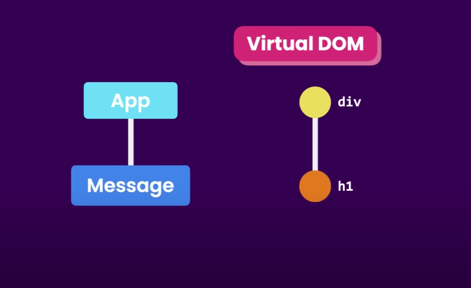

> npm create vite@latest aman-portfolio

> npm install
    - install all the dependencies


# REACT COMPONENT
- file extention of react file .tsx
- funtion based compoenent
    - create 
    ```
    funtion Message(){
        // java xml
        return <h1> hellow <h1/>
    }
    ```

    - export it 
    ```
    export default Message;
    ```

    -importing
    ```
    import Message from './message'
     ```

    - to use it
    ```
    <div> < Message /> <div/>
    ```



# React ecosystem
- react is just a library
- react is only good with dynamic ui.
while for other thing, routing, http calls, managing app state, internationlization, form validation, animations, we use different tools to achive this goals

# bootstrap
- no need of index.css file, so deleted
- no need of any app.css code removed it
- and in main import bootstrap, remove index.css import
``` 
import 'bootstrap/dist/css/bootstrap.css'
 ```


 # Components
 - in react component can't return more than one compoent

## ListGroup


# State